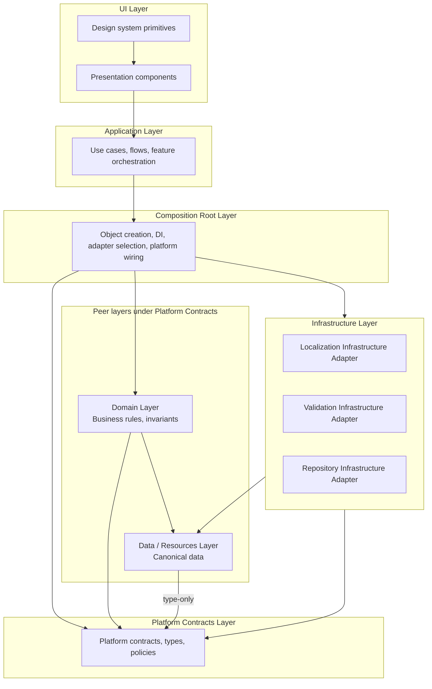
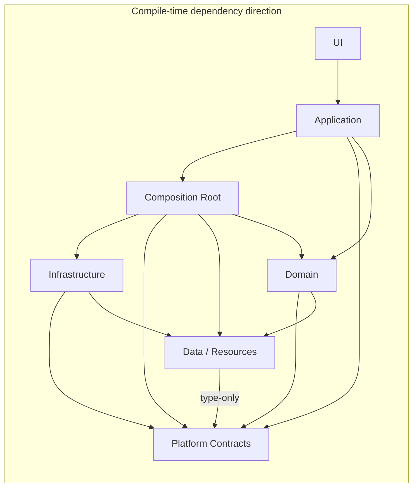

# ADR-0011 — Platform Infrastructure Layer

## Status

Approved

## Context

Diabetes Universe строит **Platform Foundation** по методологии Architecture-Driven Development (ADD).

В ходе реализации I18N-05 (Bundle Loader Foundation) обнаружена **циклическая зависимость** между Localization Platform Contracts и Localization Data / Resources. ADR Review установил, что корневая причина — не loader как концепция, а **отсутствие утверждённого Infrastructure Layer**.

Реализации In-Memory Loader были размещены внутри contract layer, что нарушило:

- Platform Independence
- Architecture Lock Principle
- Single Source of Truth (взаимозависимость platform ↔ data)

Архитектурная документация уже предусматривает: _«Domain and infrastructure layers will be introduced through explicit architecture decisions when their requirements exist.»_

Требование I18N-05 создало первую infrastructure-реализацию. Настало время формализовать место Infrastructure Layer — и связанного с ним Composition Root — для всей платформы.

## Problem

1. Нет официального определения Infrastructure Layer в Platform Foundation.
2. Нет официального определения Composition Root как отдельного слоя сборки.
3. Platform contract layer смешивается с concrete adapters.
4. Data layer рискует обрасти loader-логикой (или наоборот).
5. Application layer неотделим от wiring и DI.
6. Нет dependency rules, предотвращающих циклические зависимости.
7. Будущие модули (Validation, Auth, Storage, AI, Marketplace, OTA) не имеют шаблона размещения реализаций.

## Decision

Вводится **Infrastructure Layer** как группа **Infrastructure Adapter**-реализаций и отдельный слой **Composition Root** для сборки платформы.

### Структура слоёв Platform Foundation

| Слой                   | Архитектурная роль      | Ответственность                                            |
| ---------------------- | ----------------------- | ---------------------------------------------------------- |
| **UI**                 | Presentation            | Components, design system, accessibility                   |
| **Application**        | Feature orchestration   | Use cases, flows; использует собранную платформу           |
| **Composition Root**   | Platform wiring         | Object creation, DI, adapter selection, environment config |
| **Infrastructure**     | Adapter implementations | Concrete technology bindings for platform contracts        |
| **Platform Contracts** | Platform vocabulary     | Interfaces, types, policies, runtime API contracts         |
| **Domain**             | Business logic          | Rules, invariants, entity semantics                        |
| **Data / Resources**   | Canonical data          | Messages, metadata, schemas — Single Source of Truth       |

### Архитектурная диаграмма слоёв

Domain и Data / Resources — **peer-слои** под Platform Contracts. Они не образуют последовательную цепочку.



**Правила зависимостей на диаграмме:**

- UI зависит от Application.
- Application использует Composition Root (собранную платформу).
- Composition Root связывает Infrastructure, Platform Contracts и Domain.
- Infrastructure зависит от Platform Contracts и Data / Resources.
- Domain зависит от Platform Contracts и Data / Resources.
- Data / Resources зависит от Platform Contracts **только через type-only** зависимости.

### Naming convention (архитектурная роль)

```
{Platform Module} Infrastructure Adapter
```

Примеры:

- **Localization Infrastructure Adapter**
- **Remote Localization Infrastructure Adapter**
- **Validation Infrastructure Adapter**
- **Repository Infrastructure Adapter**
- **Storage Infrastructure Adapter**
- **Authentication Infrastructure Adapter**

Физическое расположение adapter-реализаций в monorepo **не определяется** данным ADR и будет установлено отдельным решением при реализации.

### Localization (первый применимый случай)

| Слой                                | Архитектурная роль                                             |
| ----------------------------------- | -------------------------------------------------------------- |
| Localization Platform Contracts     | Interfaces, types, runtime API (`TranslationBundleLoader`, …)  |
| Localization Data / Resources       | Canonical messages, metadata, namespaces                       |
| Localization Infrastructure Adapter | In-Memory Loader implementations (текущий код I18N-05)         |
| Composition Root                    | Выбор adapter, wiring `createLocalizationPlatform()` (будущий) |

## Composition Root Only Principle

> Ни один компонент системы не имеет права самостоятельно выбирать конкретную инфраструктурную реализацию. Все инфраструктурные реализации создаются и связываются исключительно Composition Root.

### Запрещено создавать Infrastructure Adapter внутри:

- UI
- Application
- Domain
- Platform Contracts
- других Infrastructure Adapter

### Пример запрещённого кода

```typescript
// ❌ Запрещено вне Composition Root
new InMemoryTranslationBundleLoader(fallbackPolicy);
```

Подобные конструкции допускаются **только** внутри Composition Root.

## Dependency Rules

Правила разделены на два независимых подраздела: **compile-time** (импорты типов и интерфейсов) и **runtime** (создание объектов и связывание).

> **Compile-time импорт не означает runtime зависимость.**
> Runtime wiring выполняет **только** Composition Root.

### Compile-time Dependency Rules

Описывают, какие слои могут **импортировать** типы, интерфейсы и контракты.

| From ↓ / To →          | UI  | Application | Composition Root | Infrastructure | Platform Contracts | Data / Resources | Domain         |
| ---------------------- | --- | ----------- | ---------------- | -------------- | ------------------ | ---------------- | -------------- |
| **UI**                 | —   | ✅          | ❌               | ❌             | ⚠️ types only      | ❌               | ❌             |
| **Application**        | ❌  | —           | ✅               | ❌             | ✅                 | ⚠️ rare          | ✅             |
| **Composition Root**   | ❌  | ❌          | —                | ✅             | ✅                 | ✅               | ⚠️ wiring only |
| **Infrastructure**     | ❌  | ❌          | ❌               | —              | ✅                 | ✅               | ❌             |
| **Platform Contracts** | ❌  | ❌          | ❌               | ❌             | —                  | ❌               | ❌             |
| **Data / Resources**   | ❌  | ❌          | ❌               | ❌             | ✅ type-only       | —                | ❌             |
| **Domain**             | ❌  | ❌          | ❌               | ❌             | ✅                 | ✅               | —              |

#### Запрещённые compile-time зависимости

```
❌ Platform Contracts → Infrastructure
❌ Platform Contracts → Data / Resources (runtime imports)
❌ Platform Contracts → Composition Root
❌ Platform Contracts → Application
❌ Platform Contracts → UI
❌ Data / Resources → Infrastructure
❌ Data / Resources → Composition Root
❌ Infrastructure → Infrastructure (cross-adapter)
❌ Infrastructure → Composition Root
❌ Infrastructure → Application
❌ Infrastructure → UI
❌ UI → Infrastructure (direct)
❌ UI → Composition Root (direct)
❌ Application → Infrastructure (direct)
❌ Domain → Infrastructure
❌ Domain → Composition Root
```

#### Допустимые compile-time зависимости

```
✅ Data / Resources → Platform Contracts (type-only)
✅ Infrastructure → Platform Contracts
✅ Infrastructure → Data / Resources (when adapter serves specific data source)
✅ Composition Root → Platform Contracts + Infrastructure + Data / Resources + Domain (wiring)
✅ Application → Platform Contracts + Composition Root (assembled platform)
✅ Application → Domain
✅ Domain → Platform Contracts + Data / Resources
✅ UI → Application (via props/hooks provided by app layer)
```

#### Схема compile-time зависимостей



### Runtime Wiring Rules

Описывают, **кто создаёт объекты** и **кто связывает** компоненты во время выполнения.

| Действие                                     | Разрешено           | Запрещено                                                                  |
| -------------------------------------------- | ------------------- | -------------------------------------------------------------------------- |
| Создание Infrastructure Adapter              | Composition Root    | UI, Application, Domain, Platform Contracts, другие Infrastructure Adapter |
| Выбор конкретной реализации adapter          | Composition Root    | Все остальные слои                                                         |
| Регистрация сервисов / DI                    | Composition Root    | Все остальные слои                                                         |
| Связывание Platform Contracts с реализациями | Composition Root    | Все остальные слои                                                         |
| Конфигурация среды выполнения                | Composition Root    | Все остальные слои                                                         |
| Использование собранной платформы            | Application         | —                                                                          |
| Вызов методов через contract interfaces      | Application, Domain | Прямое создание adapter implementations                                    |

#### Правило предотвращения циклов (runtime)

> **Только Infrastructure Layer имеет право соединять Platform Contracts с Data / Resources через runtime data access.**
> **Только Composition Root Layer имеет право создавать Infrastructure Adapters и собирать платформу.**
> Platform Contracts никогда не создают и не связывают Infrastructure Adapters.

## Architecture Enforcement

Цель раздела — определить не архитектуру, а правила её **обязательного соблюдения**.

1. Архитектурные правила ADR являются **обязательными** для всех новых платформенных модулей.

2. Запрещены **циклические зависимости** между архитектурными слоями и пакетами.

3. **Platform Contracts** не могут иметь runtime-зависимости от Data / Resources или Infrastructure.

4. **Data / Resources** не могут зависеть от Infrastructure.

5. **Infrastructure Adapter** не могут зависеть друг от друга напрямую.

6. **Composition Root** остаётся единственным местом создания и связывания Infrastructure Adapter.

7. Любое нарушение этих правил считается **архитектурным дефектом** и должно устраняться **до завершения реализации**.

8. По мере развития проекта соблюдение этих правил должно проверяться **архитектурным аудитом** и **средствами CI**. Конкретные инструменты не определяются данным ADR — фиксируется только принцип обязательной проверки.

## Alternatives

### A. Infrastructure внутри platform contract packages

Отклонён: доказанный цикл; нарушает Platform Independence.

### B. Единый Infrastructure monolith

Отклонён: god package; плохая масштабируемость.

### C. Infrastructure Layer как группа adapter-реализаций (рекомендуемый)

Принят. См. Decision.

### D. Infrastructure и Composition Root только в Application

Отклонён: нет переиспользования между Web, Mobile, Backend; дублирование wiring.

## Consequences

### Positive

- Ацикличный dependency graph
- Platform contract layer остаётся стабильным (Architecture Lock)
- Composition Root изолирует wiring от use cases
- Compile-time и runtime правила разделены — нет смешения понятий
- Composition Root Only Principle предотвращает утечку infrastructure в другие слои
- Architecture Enforcement закрепляет обязательность правил и механизм их проверки
- Granular adapters: каждая платформа берёт только нужное
- Plugin Architecture: plugin = adapter, реализующий contract
- Traceability: каждый adapter → ADR → contract
- Единый паттерн для всех будущих platform modules
- Физическая структура monorepo не зафиксирована преждевременно

### Negative

- Дополнительный слой (Composition Root) увеличивает число архитектурных понятий
- Требуется discipline: не размещать implementations в contract packages; не wire в Application
- Migration I18N-05 code из contract layer в Localization Infrastructure Adapter

### Neutral

- Shared types остаются для cross-cutting domain types (не infrastructure)
- UI layer остаётся presentation layer (не infrastructure)
- Физическое размещение adapter-реализаций — отдельное решение

## Future Evolution

| Phase                          | Action                                                                                                       |
| ------------------------------ | ------------------------------------------------------------------------------------------------------------ |
| **После утверждения ADR-0011** | Перенести In-Memory Loader в Localization Infrastructure Adapter (физическое размещение — отдельное решение) |
| **I18N-06+**                   | Реализовать Composition Root wiring для `createLocalizationPlatform()`                                       |
| **Validation sprint**          | Validation Platform Contracts + Validation Infrastructure Adapter                                            |
| **Repository sprint**          | Repository Platform Contracts + Repository Infrastructure Adapter(s)                                         |
| **OTA / CDN**                  | Remote Localization Infrastructure Adapter                                                                   |
| **Mobile**                     | Mobile Composition Root + platform-specific adapters                                                         |
| **Plugin Architecture**        | Third-party adapters implementing platform contracts                                                         |

### Open questions (для будущих ADR)

- Нужен ли отдельный **Platform Runtime** слой для orchestration logic (отдельно от contracts, adapters и Composition Root)?
- Где живёт **shared test infrastructure** для adapter-реализаций?
- Versioning policy для Infrastructure Adapters при breaking changes в contracts?
- Физическая структура monorepo для Infrastructure Adapters (отдельный ADR)?

## Implementation notes

- **CR-01 (2026-08-02):** `@diabetes-universe/platform` реализует Platform
  Runtime Foundation — runtime aggregate (`createPlatformRuntime()`), не
  Composition Root. `@diabetes-universe/platform-web` реализует первый
  environment-specific Composition Root для Web: adapter selection, readiness
  orchestration (`whenReady()` + selective preload), final aggregation.
  `apps/web` bootstrap, React Provider и hooks остаются отдельным этапом.

## Date

2026-08-02

## Author

Platform Architecture (ADR Review follow-up)
