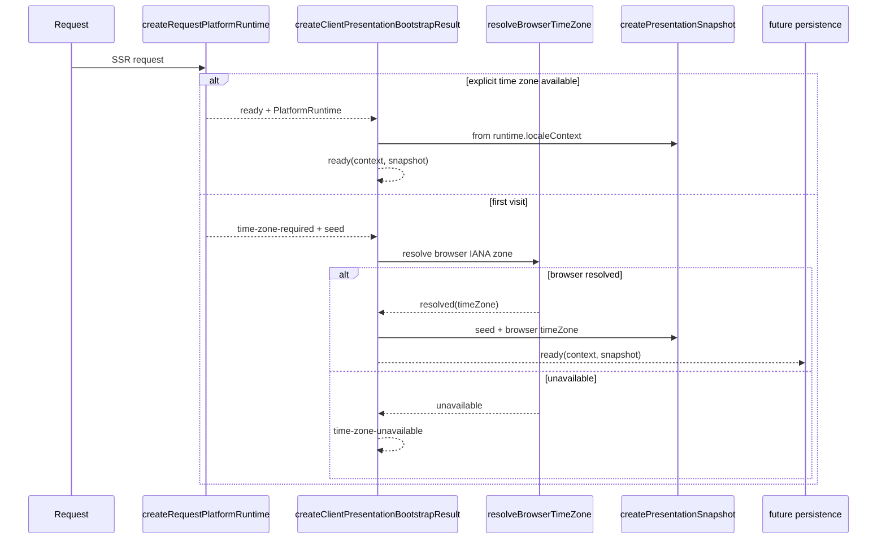

# Presentation Context Foundation

## Purpose

Define the Presentation Context Foundation for Web UI integration between thin
Next.js bootstrap (CR-02) and future React Presentation Integration (CR-03B+).

## Status

Approved — CR-03A Feature Complete

## Responsibilities

- canonical immutable `PresentationContext` (alias of `LocaleContext`);
- JSON-serializable immutable `PresentationSnapshot`;
- client-only browser IANA time zone resolution;
- validated snapshot restore;
- first-visit client orchestration;
- future persistence contract (`PresentationPersistence`).

## Non-responsibilities

- React Context, Provider, or hooks;
- Next.js route or cookie integration;
- `PlatformRuntime` creation on the client;
- Dashboard, Timeline, or Quick Add migration;
- locale switch UI, Settings, or account profile;
- telemetry;
- medical or authentication data.

## PresentationContext

`PresentationContext` is a type alias of `LocaleContext` from
`@diabetes-universe/i18n`. Language, locale, and time zone remain independent
dimensions per ADR-0009. The contract is immutable and contains no domain,
medical, browser, or runtime objects.

## ServerPresentationSeed

`ServerPresentationSeed` is defined in `apps/web/lib/platform/` and included in
`RequestPlatformBootstrapResult` when bootstrap status is `time-zone-required`.

It carries immutable server-resolved locale preferences from the same canonical
locale resolution used by the ready bootstrap flow:

- `language`
- `locale`
- `hourCycle`
- optional `numberingSystem`
- optional `calendar`

It must not contain time zone, `PlatformRuntime`, localization/formatting
services, translation bundles, medical data, or browser objects.

## PresentationSnapshot

Versioned (`version: 1`) JSON-serializable DTO used for:

- server/client boundary transport;
- hydration alignment;
- future persistence;
- restoring `PresentationContext` after validation.

Snapshots must never contain `PlatformRuntime`, translation bundles, functions,
or medical data.

Operations:

- `createPresentationSnapshot(context)`
- `restorePresentationContext(snapshot)` → `restored | invalid`

## Browser time zone detection

Client-only `resolveBrowserTimeZone()` in `presentation/client.ts` reads
`Intl.DateTimeFormat().resolvedOptions().timeZone`.

Returns:

- `{ status: 'resolved', timeZone }`
- `{ status: 'unavailable' }`

No UTC, geographic, or locale-derived fallback is applied.

## First-visit lifecycle



`ServerPresentationSeed` is produced by CR-02 bootstrap. Client orchestration
combines `seed` with browser IANA time zone; it does not accept a separate
non-canonical server locale input.

## Validation

All snapshots are validated before restore. Unknown versions, missing required
fields, empty strings, and invalid IANA zones are rejected without guessing.

IANA time zone validation is consolidated in
`apps/web/lib/platform/is-valid-iana-time-zone.ts` and shared by bootstrap and
presentation validation.

## Ownership

| Concern                  | Owner                                 |
| ------------------------ | ------------------------------------- |
| Presentation contracts   | `apps/web/lib/platform/presentation/` |
| Server bootstrap + seed  | `apps/web/lib/platform/` (CR-02)      |
| Platform runtime         | `@diabetes-universe/platform-web`     |
| Future React integration | CR-03B                                |

## Server/client boundary

| Module                                    | Boundary              | Export surface        |
| ----------------------------------------- | --------------------- | --------------------- |
| `createRequestPlatformRuntime`            | server-only           | `lib/platform/`       |
| `resolveBrowserTimeZone`                  | client-only           | `presentation/client` |
| `createClientPresentationBootstrapResult` | client orchestration  | `presentation/client` |
| snapshot create/restore                   | isomorphic validation | `presentation/`       |

Server modules must not import `resolve-browser-time-zone.ts` or
`presentation/client.ts`.

## Public API

Isomorphic (`presentation/index.ts`):

- `PresentationContext`, `PresentationSnapshot`
- `createPresentationSnapshot`, `restorePresentationContext`
- `ClientPresentationBootstrapResult`, `PresentationPersistence`

Client-only (`presentation/client.ts`):

- `resolveBrowserTimeZone`, `BrowserTimeZoneResolution`
- `createClientPresentationBootstrapResult`, `CreateClientPresentationBootstrapInput`

Bootstrap (`lib/platform/index.ts`):

- `createRequestPlatformRuntime`, `RequestPlatformBootstrapResult`
- `ServerPresentationSeed`, `RequestPresentationContext`

## Persistence abstraction

`PresentationPersistence` defines `read()` / `write()` for future adapters.
CR-03A does not implement cookies, `localStorage`, or Next.js `cookies()`.

## Security and privacy

Snapshots contain presentation preferences only (language, locale, time zone,
formatting dimensions). They must not contain names, emails, user IDs, medical
data, tokens, or secrets.

## Failure states

| State                   | Meaning                                  |
| ----------------------- | ---------------------------------------- |
| `time-zone-required`    | Normal SSR first visit (CR-02) + seed    |
| `time-zone-unavailable` | Browser could not supply valid IANA zone |
| `invalid` snapshot      | Restore rejected after validation        |

## Dependency rules

```text
apps/web/lib/platform/presentation
        ↓
@diabetes-universe/i18n (types)
apps/web/lib/platform (CR-02 bootstrap types + seed)
```

Forbidden:

- imports from Dashboard, Timeline, Quick Add;
- direct Infrastructure Adapter imports;
- `PlatformRuntime` creation in CR-03A client orchestration;
- separate non-canonical server locale input in client bootstrap.

## CR-03C integration (Feature Complete per ADR-0013)

CR-03C wires server bootstrap, serializable `ApplicationPlatformBootstrap`, and
`ApplicationRuntimeGate` into the root layout. The gate owns client-realm runtime
assembly and mounts `PlatformProvider` only when runtime is ready. Cookie
persistence remains deferred. See
[Application Platform Integration](application-platform-integration.md) and
[ADR-0013](../../adr/0013-web-client-runtime-ownership.md).

## Future I18N-02 integration

I18N-02 will migrate Dashboard, Timeline, and Quick Add to platform hooks.
CR-03C keeps product modules on existing local/mock state.

## Architecture references

- [ADR-0012 — User Time Zone Policy](../../adr/0012-user-time-zone-policy.md)
- [Web Composition Root](../composition-root/web-composition-root.md)
- [CR-02 Web README](../../../apps/web/README.md)
