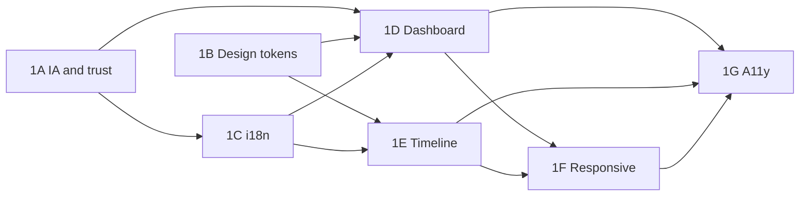

# UX/UI Wave 1 — Proposed Implementation Plan

Date: 2026-08-23  
Prerequisite: [Dashboard + Timeline Current-State Audit](./dashboard-timeline-current-state-audit.md)  
Status: **Proposal only** — requires product/architecture approval before implementation  
Baseline: `main` @ `1be172a` (P10 merged)

## Wave 1 objective

Elevate Dashboard and Timeline from **demo-grade local prototype** to **world-class clarity** for people living with diabetes — without copying Apple Health / Google / Notion visuals, and without entering P11/P12 sync runtime or production medical enablement.

Quality bar dimensions:

- **Clarity** — status and history understandable in <10 seconds
- **Trust** — no mock clinical interpretation; explicit data provenance
- **Efficiency** — frequent logging ≤3 interactions where feasible
- **Accessibility** — WCAG 2.2 AA on both surfaces
- **Consistency** — one visual/language system across Dashboard and Timeline

---

## Recommended sub-phases

Sequence is dependency-ordered based on repository evidence (i18n split, token gap, mock blocks, shared store).

### Wave 1A — Information architecture & trust cleanup

**Goal:** Remove misleading UI; align hierarchy with diabetes user mental models.

**Status:** **IMPLEMENTATION CANDIDATE** — see [UX Wave 1A Implementation](../implementation/ux-wave-1a-ia-trust-cleanup.md)

Scope:

- Remove or gate AI Insight mock from production UI
- Remove hardcoded reminders from Day Summary until real reminders product exists
- Reorder Dashboard blocks: **status (Last Glucose) before Next Action** (validate with product)
- Decide demo seed strategy for first-run vs empty users
- Document Dashboard vs Timeline responsibilities (no feature implementation)

Deliverables: IA decision record, updated specs, feature flags or content gates.

**Dependencies:** None  
**Risk:** Low  
**Blocks:** 1C content decisions

---

### Wave 1B — Design system foundation (code)

**Goal:** Close gap between `docs/design-system/*` and runtime.

**Status:** **IMPLEMENTATION CANDIDATE** — see [UX Wave 1B Implementation](../implementation/ux-wave-1b-ui-foundation.md)

Scope:

- Implement token layer (`@theme` / CSS variables) per spec 11
- Consolidate form field styles (ui-styles, QuickAddFields, event-detail → one source)
- Extend `@diabetes-universe/ui` with Card, SecondaryButton, SectionHeader patterns used by dashboard
- Theme strategy decision: light-only for Wave 1 **or** full dark with toggle (currently dead `dark:` code on dashboard)

Deliverables: Token package or globals.css theme, component spec compliance checklist.

**Dependencies:** None (can parallel with 1A)  
**Risk:** Medium — wide touch surface  
**Blocks:** 1C, 1D visual consistency

---

### Wave 1C — Localization & content unification

**Goal:** Single-locale-per-session UX; no mixed EN/RU chrome.

Scope:

- Migrate Timeline hardcoded strings to i18n keys (shell, list states, toolbar, detail, FAB, TopBar)
- Align `ru`/`uk` bundles or enforce explicit locale policy
- Dashboard: wire remaining literals (if any post-1A)
- Add timeline i18n E2E parity with dashboard i18n specs

Deliverables: Complete `timeline.*` and `dashboard.*` catalogs, language-of-parts compliance.

**Dependencies:** 1A (stable string set)  
**Risk:** Medium  
**Blocks:** 1F accessibility language audit

---

### Wave 1D — Dashboard redesign (implementation)

**Goal:** Deliver recommended Dashboard purpose with real data only.

Scope:

- Last Glucose hero treatment (unit, time, stale, optional tap-through)
- Next Action refinement (render navigate intent; reduce duplication with FAB)
- Day Summary — zero vs missing semantics
- Recent Events — interactive preview or tighter Timeline handoff
- Header — real user/session identity integration point (auth exists; wire when ready)
- Store hydration loading states wired in `dashboard-root.tsx`

Deliverables: Updated dashboard components; no new routes.

**Dependencies:** 1A, 1B, 1C  
**Risk:** Medium

---

### Wave 1E — Timeline redesign (implementation)

**Goal:** Trustworthy longitudinal history surface.

Scope:

- Kind-aware edit experiences (or guarded fields per event type)
- Empty-state UX — expose add + filter education without requiring events
- Optional: routable detail (`/timeline?event=` or dedicated segment) — architecture decision required
- Provenance UX for device/import when data exists
- Pagination UX clarity (client vs history load)
- Desktop width policy (`max-w-3xl` vs responsive expansion)

Deliverables: Updated timeline components; optional routing ADR.

**Dependencies:** 1B, 1C  
**Risk:** Medium–high if deep linking added

---

### Wave 1F — Responsive & mobile polish

**Goal:** Excellent 360–412px experience; no overlap/clipping.

Scope:

- Quick Add step reduction (time picker defaults, category memory)
- FAB/header CTA consistency audit
- Landscape + tablet layouts
- Verify all breakpoints in CI viewport matrix

Deliverables: E2E viewport expansion; responsive spec updates.

**Dependencies:** 1D, 1E form changes  
**Risk:** Low

---

### Wave 1G — Accessibility & medical UX hardening

**Goal:** WCAG 2.2 AA conformance on Dashboard + Timeline.

Scope:

- Skip link, contrast audit, color-independent status icons
- Avatar alt strategy
- Medical safety copy review (insights, next action, summaries)
- Screen reader journeys for add/edit/delete

Deliverables: A11y test checklist, axe/pa11y CI gate proposal.

**Dependencies:** 1C, 1D, 1E  
**Risk:** Low

---

## Parallelization diagram

---

## Explicitly out of Wave 1 scope

- P11 continuous sync / offline queue UI
- P12 conflict resolution UI
- Production Neon / medical API user-facing adoption flows
- Charts/CGM curves (unless product adds as Wave 2)
- Reminders product implementation
- AI insight engine production activation
- Marketplace, recipes, reports modules

---

## Success metrics (proposal)

| Metric                                 | Target                           |
| -------------------------------------- | -------------------------------- |
| Add glucose (median interactions)      | ≤3                               |
| Time to last glucose on dashboard load | <2s after store ready            |
| WCAG 2.2 AA violations (axe)           | 0 critical on Dashboard/Timeline |
| i18n coverage (user-visible strings)   | 100% keyed                       |
| Mock/clinical placeholder surfaces     | 0 in production UI               |

---

## Approval gates

1. Product sign-off on IA (1A) and AI insight disposition
2. Design sign-off on token implementation (1B)
3. Architecture sign-off if Timeline deep linking (1E)
4. Independent UX review before Wave 1 promotion to Feature Complete

---

## Related documents

- [Current-State Audit](./dashboard-timeline-current-state-audit.md)
- [Component Map](./dashboard-timeline-component-map.md)
- [Dashboard Architecture Overview](../architecture/dashboard/overview.md)
- [Timeline Architecture Overview](../architecture/timeline/overview.md)
- [Design Tokens Specification](../design-system/11-design-tokens-specification.md)
